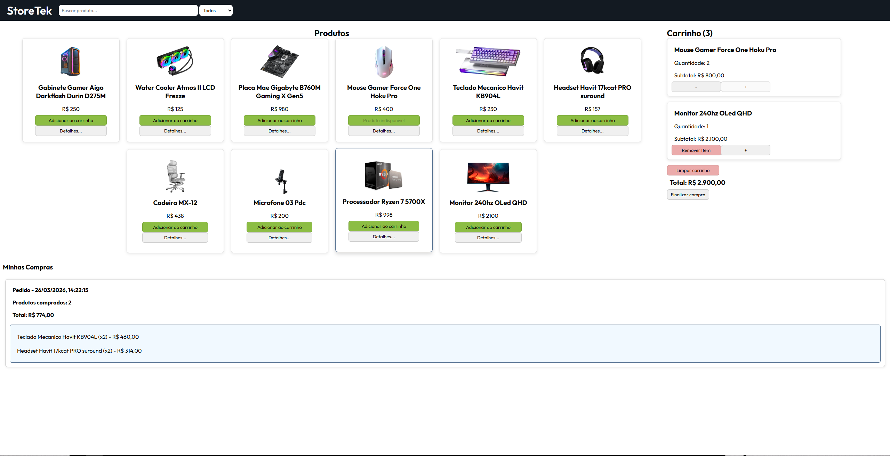

# 🛒 Mini E-commerce (Vanilla JS)

Projeto desenvolvido com **JavaScript puro (Vanilla JS)** com foco em prática de **arquitetura modular, manipulação de DOM, gerenciamento de estado e persistência de dados**.

---

## 🚀 Objetivo

Este projeto foi criado como parte dos meus estudos em desenvolvimento frontend, com o objetivo de simular um fluxo real de um e-commerce, sem uso de frameworks, focando nos fundamentos do JavaScript.

---

## 🧠 Conceitos aplicados

* Arquitetura modular com ES Modules
* Separação de responsabilidades (state, cart, products, UI)
* Gerenciamento de estado global
* Manipulação dinâmica do DOM
* Eventos customizados (`estadoAtualizado`)
* Persistência com `localStorage`
* Renderização reativa
* Boas práticas de organização de código

---

## 🏗️ Estrutura do projeto

```
/src
 ├── app.js
 ├── state.js
 ├── products.js
 ├── cart.js
 ├── orders.js
 ├── ui.js
 └── modal.js
```

---

## 🛍️ Funcionalidades

### Produtos

* Listagem de produtos
* Busca por nome
* Filtro por categoria
* Modal de detalhes do produto
* Exibição de imagem, nome, preço e estoque

### Carrinho

* Adicionar produtos
* Remover produtos
* Controle de quantidade
* Limpar carrinho
* Cálculo de subtotal e total
* Contador dinâmico de itens

### Pedidos

* Finalização de compra com confirmação
* Salvamento de pedidos no `localStorage`
* Histórico de compras
* Visualização de pedidos em formato de card
* Expansão de pedido para ver itens
* Cálculo de subtotal por item

### UI / UX

* Atualização automática via evento global
* Toast notifications (success, error, warning)
* Limite de toasts simultâneos
* Layout com Flexbox
* Cards de produto com imagem
* Feedback visual de interação

---

## 💾 Persistência de dados

Os dados de pedidos são armazenados no navegador usando:

```javascript
localStorage
```

Estrutura:

```
[
  {
    data: "data da compra",
    itens: [{ id, quantidade }],
    total: number,
    quantidadeItens: number
  }
]
```

---

## 🧩 Arquitetura

O projeto segue uma arquitetura modular simples:

* **state.js** → estado global
* **products.js** → dados e busca de produtos
* **cart.js** → lógica do carrinho
* **orders.js** → persistência de pedidos
* **ui.js** → renderização
* **modal.js** → controle de modal

A comunicação entre mudanças de estado e UI é feita através de:

```javascript
document.dispatchEvent(new Event("estadoAtualizado"));
```

---

## 🛠️ Tecnologias

* JavaScript (ES Modules)
* HTML5
* CSS3 (Flexbox)
* LocalStorage

---

## 📸 Preview



---

## 📈 Próximas melhorias

* Melhorar UI/UX geral
* Adicionar animações mais avançadas
* Implementar loading states
* Possível integração com API futura
* Refatoração para escalabilidade (ex: store pattern)

---

## 🎯 Aprendizados

Durante o desenvolvimento deste projeto, pratiquei:

* Organização de código em módulos
* Controle de estado sem frameworks
* Estruturação de aplicações reais com JS puro
* Criação de componentes reutilizáveis
* Pensamento em arquitetura frontend

---

## 📌 Observação

Este projeto tem fins educacionais e faz parte do meu portfólio como desenvolvedor frontend.

---

## 👨‍💻 Autor

Desenvolvido por **Eduardo Gnt**


